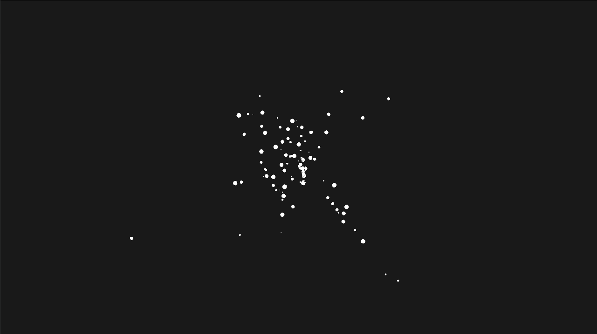

# bevy-nbody

An N-body simulation in Rust using the [bevy](https://bevyengine.org) crate for rendering and [bigbang](https://docs.rs/bigbang/0.0.9/bigbang/) crate for the n-body calculations.

## Controls

|key | control|
|----|--------|
| R | reset the simulation |
| Left Click | hold and move mouse to pan the view | 
| Middle Click | hold and move mouse up and down to zoom in and out |
| Right Click | click on a body to focus the camera on that body |